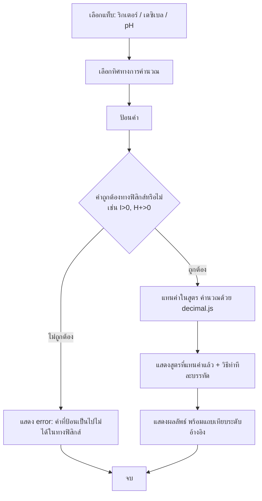

# FLOWCHART — ผังการทำงานของ Log-Decoder

แผนภาพด้านล่างเขียนด้วย Mermaid สามารถนำโค้ดในบล็อก ```mermaid``` ไปวางที่ [mermaid.live](https://mermaid.live)
เพื่อดูภาพ/ส่งออกเป็น PNG หรือ SVG ได้ทันที หรือใช้ Mermaid CLI (`mmdc -i FLOWCHART.md -o flowchart.png`)
ถ้าติดตั้ง `@mermaid-js/mermaid-cli` ไว้แล้ว

## ผังหลัก: ตัวช่วยแก้ลอการิทึม (Feature 1)

```mermaid
flowchart TD
    A[รับ input จากผู้ใช้] --> B{input ว่างหรือไม่}
    B -- ว่าง --> E1[แสดง error: กรุณาป้อนนิพจน์/สมการ]
    B -- ไม่ว่าง --> C[preprocess รูปแบบ log/ln ทุกแบบ]
    C --> D[parse ด้วย mathjs เป็น AST]
    D --> F{parse สำเร็จหรือไม่}
    F -- ไม่สำเร็จ --> E2[แสดง error: แปลความหมายนิพจน์ไม่ได้]
    F -- สำเร็จ --> G{มีเครื่องหมาย = หรือไม่}

    G -- ไม่มี = ทำให้ง่าย --> H[ตรวจสอบเงื่อนไข/โดเมน]
    G -- มี = แก้สมการ --> H

    H --> I[แสดงแผงเงื่อนไข: arg>0, base>0 และ ≠ 1]
    I --> J{โหมดใด}

    J -- ทำให้ง่าย --> K[ใช้สมบัติลอการิทึมทีละขั้น\nproduct/quotient/power/change-of-base/...]
    K --> L[บันทึกทุกขั้นตอนเป็น Step]
    L --> M[แสดงผลลัพธ์ที่ทำให้ง่ายแล้ว]

    J -- แก้สมการ --> N{รูปแบบสมการ}
    N -- สมการลอการิทึม --> O[รวม log ด้วยสมบัติผลคูณ/ผลหาร]
    O --> P[ยกกำลังทั้งสองข้างกำจัด log]
    P --> Q[แก้พหุนามที่ได้ เชิงเส้น/กำลังสอง]
    N -- สมการเลขชี้กำลัง --> R[ใส่ ln ทั้งสองข้าง ดึงตัวแปรลงมา]
    R --> S[จัดรูปแก้สมการเชิงเส้นหา x]

    Q --> T[ตรวจคำตอบแปลกปลอม: แทนค่ากลับในเงื่อนไขโดเมน]
    S --> T

    T --> U{ผ่านเงื่อนไขหรือไม่}
    U -- ไม่ผ่านทุกคำตอบ --> E3[แสดง error: ทุกคำตอบเป็นคำตอบแปลกปลอม]
    U -- ผ่านบางส่วน/ทั้งหมด --> V[แสดงคำตอบ: ผ่าน ✓ / ถูกตัดทิ้ง ✗ พร้อมเหตุผล]

    M --> W[แสดงขั้นตอนทั้งหมดแบบ Decoder reveal]
    V --> W
    W --> X[ผู้ใช้กด "ขั้นถัดไป" ดูทีละขั้น หรือคัดลอกเป็น LaTeX/ข้อความ]

    E1 --> Y[จบ - แสดงข้อความ error สีแดง ไม่มีหน้าจอว่างเปล่า]
    E2 --> Y
    E3 --> Y
```

## ผังย่อย: เครื่องคิดเลขมาตราส่วนโลกจริง (Feature 2)



## หมายเหตุ error branch ที่ครอบคลุมทั้งแอป

- input ว่าง → `empty-input`
- parse ไม่ได้ (ไวยากรณ์ผิด) → `parse-error`
- ฐาน ≤ 0 หรือ = 1 → `invalid-base`
- อาร์กิวเมนต์ ≤ 0 → `invalid-argument`
- สมการไม่มีคำตอบ → `no-solution`
- ทุกคำตอบเป็นคำตอบแปลกปลอม → `all-roots-extraneous`
- รูปแบบนิพจน์/สมการที่ solver ยังไม่รองรับ → `unsupported-expression`
- ค่าที่เป็นไปไม่ได้ในทางฟิสิกส์ (Feature 2) → `physically-impossible`

ทุก error ข้างต้นมี `messageTh` (ข้อความภาษาไทย) ติดมาด้วยเสมอ ไม่มีทางที่จะได้ `NaN` เงียบๆ หรือหน้าจอว่างเปล่า
เพราะทุกฟังก์ชันคืนค่าเป็น `Result<T>` (`{ ok: true, value } | { ok: false, error }`) และมี React Error Boundary
เป็นกันชนสุดท้ายเสริมอีกชั้นหนึ่ง
